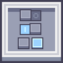

    

# Modernity-GTNH-UI

The objective of this resource pack is to update ~~all~~ most of the GUI elements to the style of [Applied Energistics 2](https://github.com/AppliedEnergistics/Applied-Energistics-2) in Minecraft 1.21.1+.Some will be updated to match the higher version's style of the mods. \
Suggested to use with [Modernity-GTNH](https://github.com/ModernityGTNH/Modernity-GTNH)

It's still work in progress, and it is expected to be compatible with GTNH version ~~2.6.0, 2.7.1, 2.8.0~~ 2.9.0

## Features
All the GUI elements used in the mods of GTNH will be supported.

Extra supports:
1. [Catalogue](https://github.com/JackOfNoneTrades/Catalogue-Vintage)
2. [Just Enough Calculation](https://github.com/GTNewHorizons/JustEnoughCalculation)
3. [Cosmetic Armor Reworked](https://github.com/zlainsama/CosmeticArmorReworked)
4. [Industrial Craft 2](https://www.industrial-craft.net/) (Fully Supported!)
5. [World Edit](https://github.com/GTNewHorizons/worldedit-gtnh)
6. [Decocraft](https://www.curseforge.com/minecraft/mc-mods/decocraft)
7. [Extreme Sound Muffler: Legacy](https://github.com/Lyfts/ExtremeSoundMuffler-Legacy)
8. [Trash Slot](https://github.com/TwelveIterations/TrashSlot)
9. [Box Plus Plus](https://github.com/RealSilverMoon/BoxPlusPlus)
10. [GT Not Leisure](https://github.com/ABKQPO/GT-Not-Leisure)
11. [Think Tech](https://github.com/Ol925/ThinkTech)
12. [Programmable Hatches Mod](https://github.com/reobf/Programmable-Hatches-Mod)
13. [AE2 Thing](https://github.com/asdflj/AE2Things)

Special Supports:
You will have a new style of better questing book! Enjoy it XD!

## Related resourcepacks
Modernity-GTNH [Modernity-GTNH](https://github.com/ModernityGTNH/Modernity-GTNH) \
Modernity-GTNH-Dark-UI [Modernity-GTNH-Dark-UI](https://github.com/ModernityGTNH/Modernity-GTNH-Dark-UI)

### Licensing
 
